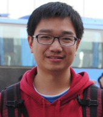

<!--<body>

</body>-->

**Lei Shi**

Staff Research And Development Engineer, Baidu Inc.

<b>Email:</b> <a href="mailto:harryshi.cs@gmail.com">harryshi.cs@gmail.com</a>

<b>Research Interests:</b> Recommender Systems, Information Retrieval, and Machine Learning

## News
[Oct 2021] One paper about personalized video search was accepted by WSDM 2022.

## Education
Sep 2012 - Jun 2018, Ph.D. in Computer Science, <a href="http://english.cas.cn" rel="nofollow"><b>Chinese Academy of Sciences</b></a>

Sep 2008 - Jun 2012, B.Eng. in Computer Science, <a href="http://en.whu.edu.cn" rel="nofollow"><b>Wuhan University</b></a>

## Experience
Apr 2013 - Jan 2014, Research Intern, <a href="http://research.microsoft.com/en-us/labs/asia/" rel="nofollow"><b>Microsoft Research Asia</b></a>

Nov 2011 - Apr 2012, SDE Intern, <b>Search Technology Center, Microsoft</b>

## Publications
### Conference & Journal Papers
Li Zhang, <b>Lei Shi</b>, Jiashu Zhao, Juan Yang, Tianshu Lyu, Dawei Yin and Haiping Lu. A GNN-based Multi-task Learning Framework for Personalized Video Search. In Proceedings of the Fifteenth International Conference on Web Search and Data Mining (<b>WSDM 2022</b>), February 2022.

Runwu Zhou, Xiaojun Chang, <b>Lei Shi</b>, Yi-Dong Shen, Yi Yang and Feiping Nie. Person Reidentification via Multi-Feature Fusion With Adaptive Graph Learning. IEEE Transactions on Neural Networks and Learning Systems (<b>TNNLS</b>) 31 (5): 1592-1601.

Hanmo Wang, Xiaojun Chang, <b>Lei Shi</b>, Yi Yang and Yi-Dong Shen. Uncertainty Sampling for Action Recognition via Maximizing Expected Average Precision. The Twenty-Seventh International Joint Conference on Artificial Intelligence (<b>IJCAI-18</b>), Stockholm, Sweden, July 2018.

<b>Lei Shi</b>, Wayne Xin Zhao and Yi-Dong Shen. Local Representative based Matrix Factorization for Cold-Start Recommendation. ACM Transactions on Information Systems (<b>TOIS</b>) 36(2) 22:1-28, 2017.

<b>Lei Shi</b> and Yi-Dong Shen. Diversifying Convex Transductive Experimental Design for Active Learning. In Proceedings of the 25th International Joint Conference on Artificial Intelligence (<b>IJCAI 2016</b>), New York City, USA, July, 2016.

<b>Lei Shi</b>, Liang Du and Yi-Dong Shen. Robust Spectral Learning for Unsupervised Feature Selection. In Proceedings of the 14th IEEE International Conference on Data Mining (<b>ICDM 2014</b>), Shenzhen, China, December 14-17, 2014. <a href="./pubs/RSFS_talk_ICDM14.pdf"> [Slides]</a> <a href="./codes/RSFS.rar"> [Code]</a>	
										
<b>Lei Shi</b>, Shuming Shi, Chin-Yew Lin, Yi-Dong Shen and Yong Rui. Unsupervised Template Mining for Semantic Category Understanding. In Proceedings of the 2014 Conference on Empirical Methods in Natural Language Processing (<b>EMNLP 2014</b>), Doha, Qatar, October 26-28, 2014.<a href="./pubs/Template_talk_EMNLP14.pdf"> [Slides]</a>
									
Peng Zhou, Liang Du, <b>Lei Shi</b>, Hanmo Wang and Yi-Dong Shen. Recovery of Corrupted Multiple Kernels for Clustering. The Twenty-Fourth International Joint Conference on Artificial Intelligence (<b>IJCAI 15</b>) , Buenos Aires, Argentina, July 2015.</li>
									
Liang Du, Peng Zhou, <b>Lei Shi</b>, Hanmo Wang, Mingyu Fan, Wenjian Wang and Yi-Dong Shen. Robust Multiple Kernel K-means using L2-1-norm. The Twenty-Fourth International Joint Conference on Artificial Intelligence (<b>IJCAI 15</b>) , Buenos Aires, Argentina, July 2015.
									
Hanmo Wang, Liang Du, Peng Zhou, <b>Lei Shi</b> and Yi-Dong Shen. Convex Batch Mode Active Sampling via alpha-relative Pearson Divergence. The Twenty-Nineth AAAI Conference on Artificial Intelligence (<b>AAAI-15</b>), Austin, Texas, USA, January 2015.
									
###Workshop Papers
Yuyu Zhang, Liang Pang, <b>Lei Shi</b> and Bin Wang, Large Scale Purchase Prediction with Historical User Actions on B2C Online Retail Platform. 2nd Workshop on Large Scale Recommender Systems, 8th ACM Conference on Recommender System (<b>RecSys 2014</b>).<a href="https://arxiv.org/pdf/1408.6515.pdf">[arXiv]</a>
									
Dilin Wang, <b>Lei Shi</b> and Jianwen Cao. Fast Algorithm for Approximate k-Nearest Neighbor Graph Construction. Data Mining in Networks workshop, the 13th IEEE International Conference on Data Mining (<b>ICDM 2013</b>), TX, USA, December 7-10, 2013.

## Contest Awards
5th Place in Mobike Big Data Challenge (2017)

7th Place in Alibaba Big Data Contest, Top 10 in 7274 teams (2014)

3rd Place in National Computational Advertising Contest (2013)

3rd Prize in National Undergraduate Information Security Contest (2011)

## Selected Honors
National Scholarship for Ph.D. Students (2016 and 2017)

IEEE ICDM 2014 Student Travel Award (2014)

EMNLP 2014 Student Scholarship (2014)

Outstanding Bachelor Thesis in Hubei Province (2012)

National Scholarship for Undergraduate Students (2010)

Academic Excellence Scholarship in Wuhan University (2009, 2010, and 2011)

## Professional Service
Reviewer: ACM TOIS, IEEE TKDE, IJCAI'16-17, AAAI'16-18, KDD'14-16, PAKDD'14
